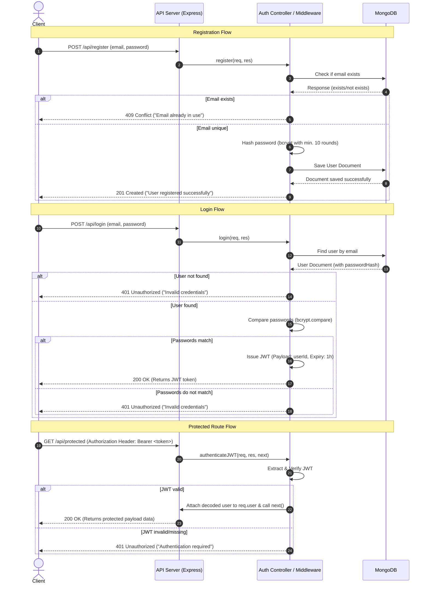
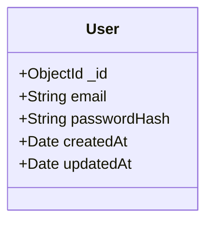

# SafePass - Simple Auth API

SafePass is a backend authentication API designed for educational purposes. It implements industry-standard security patterns, including user registration, secure password hashing using `bcrypt`, JWT-based login, and token-based route protection. The application is built on top of the modern JavaScript stack utilizing Node.js, Express, and MongoDB (via Mongoose).

---

## 📄 Reference Documents

This consolidated documentation compiles guidelines and technical details from the following source design specifications. Click the links below to view the original PDF blueprints:

*   **Product Requirements & Specifications (PRD):** [SafePass - PRD (PDF)](file:///c:/Auth/SafePass---Simple-Auth-API-prd-3Pd6O_copy.pdf)
*   **High Level Design (HLD):** [SafePass - HLD (PDF)](file:///c:/Auth/SafePass---Simple-Auth-API-hld-xTBg1_copy.pdf)
*   **Low Level Design (LLD):** [SafePass - LLD (PDF)](file:///c:/Auth/SafePass---Simple-Auth-API-lld-flWS0_copy.pdf)

---

## 🎯 1. Goals & Objectives

The primary focus of SafePass is to serve as a clean, production-grade reference for user registration and authentication systems.

| Goal | Description |
| :--- | :--- |
| **User Registration** | Allow users to register securely with an email and password. |
| **Secure Authentication** | Implement industry-standard password hashing and JWT-based session management. |
| **Protected Endpoints** | Restrict access to authenticated users on specified secure resources. |
| **Educational Simplicity** | Keep the code modular, readable, and well-commented without unnecessary bloat. |

---

## 🛠️ 2. Technical Requirements

### Functional Requirements
*   **FR1:** Users must be able to register with a valid email and password.
*   **FR2:** Passwords must be securely hashed before storage.
*   **FR3:** Users can log in with valid credentials and receive a JSON Web Token (JWT).
*   **FR4:** A valid JWT is required to access protected routes.
*   **FR5:** API must return appropriate HTTP status codes and informative error messages.
*   **FR6:** User data must be stored persistently in MongoDB.

### Non-Functional Requirements
*   **NFR1:** Built using Node.js (LTS), Express, and MongoDB.
*   **NFR2:** Codebase must follow a clean, modular structure.
*   **NFR3:** API design must follow RESTful conventions.
*   **NFR4:** Passwords must be hashed using `bcrypt` (minimum 10 salt rounds).
*   **NFR5:** JWTs must be signed using a secret stored in environment variables (`.env`).
*   **NFR6:** No frontend interface is required (API-only backend).

---

## 🏗️ 3. Architecture & Data Flow

### System Architecture
The application employs a stateless, modular architecture. A Node.js/Express server exposes REST endpoints, parses requests, runs them through routing and validation rules, applies authentication middlewares, and queries a MongoDB database using Mongoose ODM models.

```mermaid
graph TD
    Client[Client Browser / API Client]
    subgraph API Server (Node.js/Express)
        Router[Router]
        Middleware[Auth Middleware]
        Controller[Auth Controller]
    end
    subgraph Database
        DB[(MongoDB)]
    end

    Client -->|HTTP Requests| Router
    Router -->|1. GET /api/protected| Middleware
    Middleware -->|2. Verify JWT| Controller
    Router -->|POST /api/register, POST /api/login| Controller
    Controller -->|Query / Save User| DB
    Controller -->|Response (JWT / Data)| Client
```

### Component Breakdown
1.  **API Server (Express):** Listens to incoming HTTP traffic, routes requests, parses bodies, and acts as the web wrapper.
2.  **Auth Controller:** Houses the core business logic for processing user registration and sign-in operations.
3.  **Auth Middleware:** Verifies incoming tokens on protected requests.
4.  **Database Layer (MongoDB):** Provides persistent storage for User documents, maintaining data consistency and indexing fields (e.g., unique email constraint).

---

## 📈 4. Detailed Component Sequences

The sequence diagram below displays the end-to-end communication lifecycle for the three primary use cases: **Registration**, **Login**, and **Accessing Protected Resources**.



---

## 🗃️ 5. Data Model & Structure

The user document is stored in the `users` collection within MongoDB. Mongoose is utilized to enforce constraints, types, and automated validation.

### User Schema Definition



| Field Name | Type | DB Key | Constraints | Description |
| :--- | :--- | :--- | :--- | :--- |
| **Identifier** | `ObjectId` | `_id` | Auto-generated, Primary Key | Unique object identifier. |
| **Email** | `String` | `email` | Required, Unique, Lowercase, Valid Format | User registration/login email address. |
| **Password Hash** | `String` | `passwordHash` | Required, Length: 60 (bcrypt result) | Securely hashed password. Plaintext is never stored. |
| **Created Timestamp**| `Date` | `createdAt` | Auto-generated, Timestamp | The date and time the user account was registered. |
| **Updated Timestamp**| `Date` | `updatedAt` | Auto-generated, Timestamp | The date and time the user document was last modified. |

---

## 🌐 6. API Endpoint Details

The API follows strict REST conventions. Content-type for headers on requests with payloads must be `application/json`.

### 1. Register User
*   **Path:** `POST /api/register`
*   **Auth Required:** No
*   **Payload Format:**
    ```json
    {
      "email": "user@example.com",
      "password": "SecurePassword123"
    }
    ```
*   **Responses:**
    *   **`201 Created`:** User created successfully.
    *   **`400 Bad Request`:** Missing or invalid fields (e.g., weak password, invalid email format).
    *   **`409 Conflict`:** Email address is already registered.

### 2. Login User
*   **Path:** `POST /api/login`
*   **Auth Required:** No
*   **Payload Format:**
    ```json
    {
      "email": "user@example.com",
      "password": "SecurePassword123"
    }
    ```
*   **Responses:**
    *   **`200 OK`:** Login successful. Returns the JWT.
        ```json
        {
          "token": "eyJhbGciOiJIUzI1NiIsIn..."
        }
        ```
    *   **`401 Unauthorized`:** Incorrect email or password.
    *   **`400 Bad Request`:** Invalid payload fields.

### 3. Access Protected Route
*   **Path:** `GET /api/protected`
*   **Auth Required:** Yes (Header: `Authorization: Bearer <JWT_TOKEN>`)
*   **Responses:**
    *   **`200 OK`:** Authorized access granted. Returns protected resource data.
    *   **`401 Unauthorized`:** Token missing, expired, or invalid.

---

## 🔒 7. Security Specifications

*   **Password Hashing:** Passwords must be hashed using the `bcrypt` algorithm. A cost factor (salt rounds) of at least `10` is required to prevent brute-force attacks.
*   **Session Management:** JSON Web Tokens (JWT) are signed on the server using an environment-stored secret (`JWT_SECRET`).
*   **JWT Expiration:** Token lifespan must be limited to exactly `1 hour`.
*   **JWT Payload Security:** Do not include sensitive attributes (e.g., passwords or PII) inside the public JWT claims. The payload should only contain the minimal user metadata required (e.g., `userId`).
*   **Environment Configurations:** Sensitive configuration keys like database URIs (`MONGO_URI`) and JWT secret keys (`JWT_SECRET`) must be defined in local `.env` files and never checked into source control.

---

## ❌ 8. Error Handling Reference

All error responses from the API conform to the following standard object structure to ensure high developer usability:

```json
{
  "error": "Error message description detailing the failure."
}
```

| Scenario | HTTP Code | Response Content (`error`) |
| :--- | :--- | :--- |
| **Validation Error / Missing Info** | `400 Bad Request` | `"Invalid input"` / `"Invalid email or password"` |
| **Authentication Failed** | `401 Unauthorized` | `"Invalid credentials"` |
| **JWT Missing / Corrupted / Expired** | `401 Unauthorized` | `"Authentication required"` / `"Unauthorized"` |
| **Resource Conflict** | `409 Conflict` | `"Email already in use"` / `"User already exists"` |
| **Unhandled Runtime Crash** | `500 Internal Server` | `"Internal server error"` |

---

## 📦 9. Project Environment & Scope

### Project Scope
*   **In Scope:**
    *   Setup Express REST server and routing directories.
    *   Integrate MongoDB via Mongoose connection logic.
    *   Secure endpoints with token verification middleware.
    *   Create modular Controllers, Schemas, and Middlewares.
*   **Out of Scope:**
    *   Frontend interfaces, HTML client apps, or admin templates.
    *   OAuth logins (Google, GitHub, Facebook).
    *   Email address validation links (activation mails).
    *   Forgotten password reset processes.

### Development Stack & Tools
*   **Runtime:** Node.js (LTS recommended)
*   **Framework:** Express.js (latest stable version)
*   **Database:** MongoDB (Local instance or Cloud Atlas cluster)
*   **Libraries:**
    *   `mongoose`: Database schema modeling and validation.
    *   `bcrypt`: Secure password hashing logic.
    *   `jsonwebtoken`: Construct and verify JWT tokens.
    *   `dotenv`: Loading configurations from `.env` environment files.

---

## 🚀 10. How to Set Up and Run the Application

### 📋 Prerequisites
*   [Node.js](https://nodejs.org/) (v18.0.0 or higher recommended)
*   [MongoDB](https://www.mongodb.com/) (Ensure a local instance is running on port `27017` or obtain a MongoDB Atlas connection string)

### 📥 Step 1: Clone and Install Dependencies
Initialize the project workspace and install the required security and core dependencies:
```bash
npm install
```

### ⚙️ Step 2: Configure the Environment Variables
1.  Duplicate the environment template file:
    ```bash
    cp .env.example .env
    ```
2.  Open the newly created `.env` file and customize the keys if necessary:
    *   `PORT`: Port to run the server on (default: `5000`).
    *   `MONGO_URI`: The MongoDB connection string (default: `mongodb://127.0.0.1:27017/safepass`).
    *   `JWT_SECRET`: A secure cryptographically random key used to sign JSON Web Tokens.

### 🏃 Step 3: Run the Application

#### Development Mode (With Hot-Reloading)
To run the server locally with automated hot-reloading on file edits:
```bash
npm run dev
```

#### Production Mode
To run the server in standard production mode:
```bash
npm start
```

Once started, the terminal will log:
```text
[Server] SafePass Authentication API running on port 5000
[Database] MongoDB Connected to host: 127.0.0.1
```

---

## 🧪 11. Running the Automated Test Suite

We have written an isolated test suite that runs tests locally against an in-memory database server. You do **not** need a running MongoDB daemon to run the tests.

Run the test suite using Node.js's native test runner:
```bash
npm test
```

This runs the automated tests in [auth.test.js](file:///c:/Auth/test/auth.test.js) which validates:
*   Email syntax and strict complexity validators.
*   Secure duplicate detection & status responses.
*   Cryptographic hash verification checks during logins.
*   Token generation constraints & payload structure.
*   Protected endpoint validation layers.
*   Helmet HTTP response headers and tech fingerprint removal.

